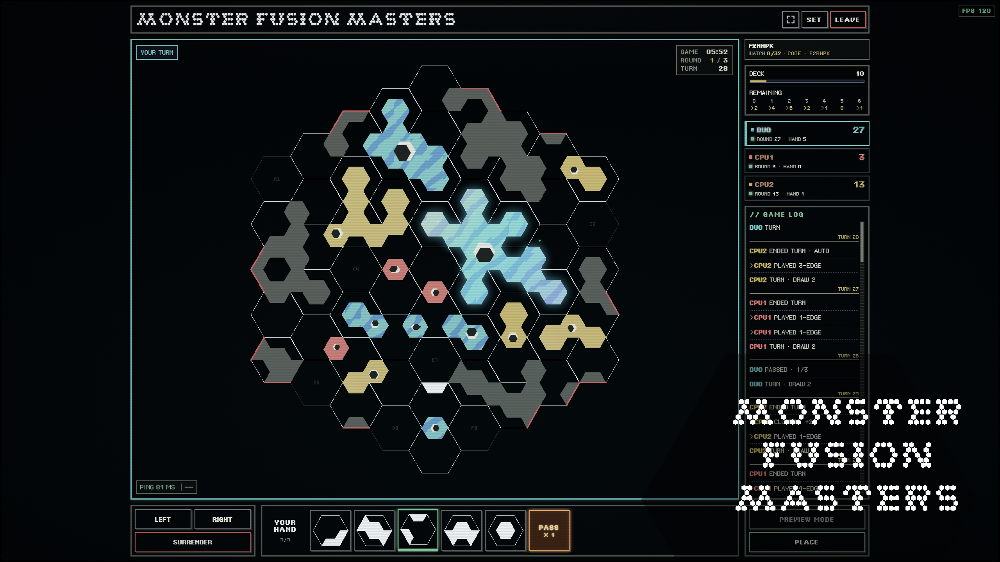
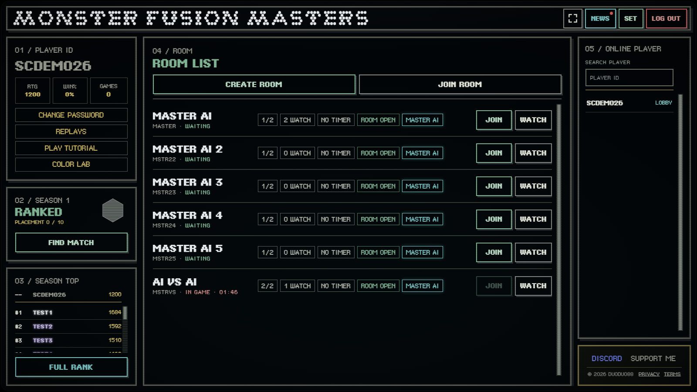
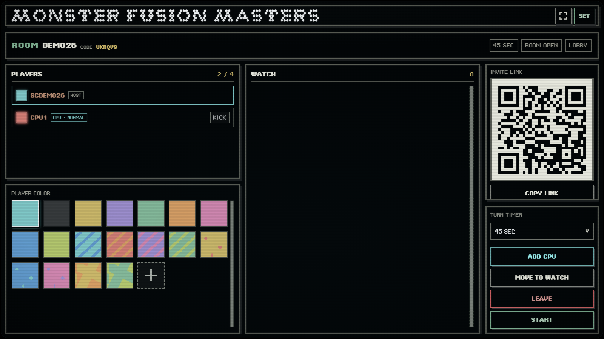
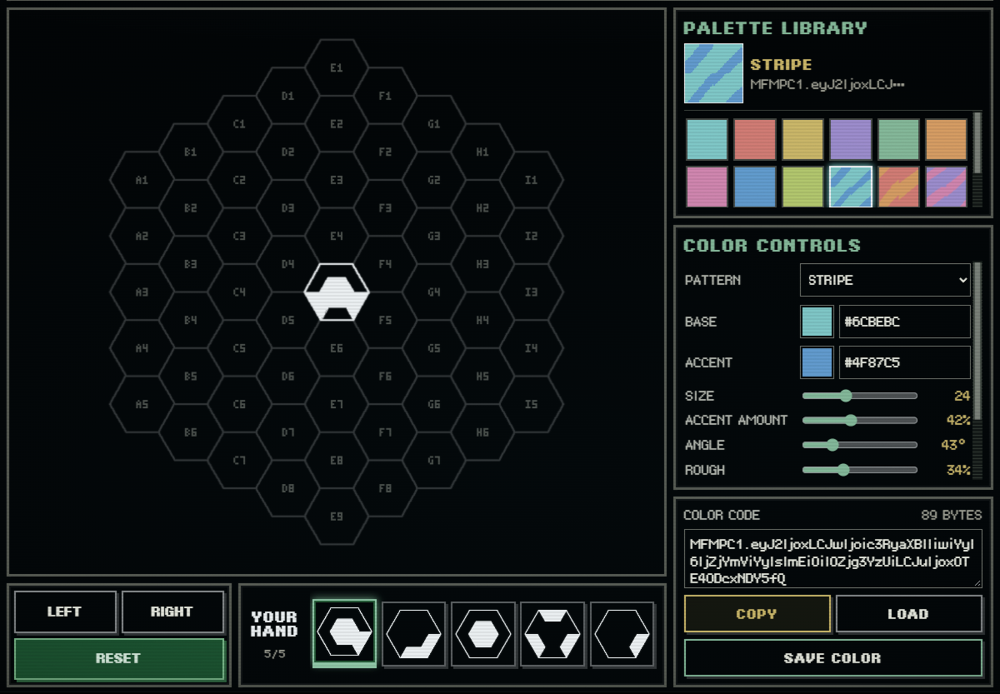
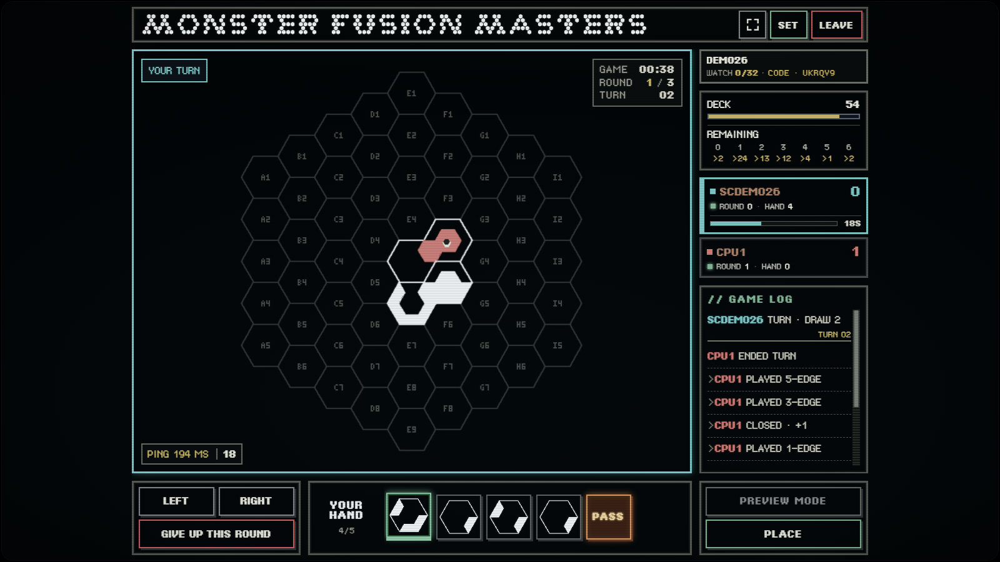

# Monster Fusion Masters

**Showcase repository:** `monster-fusion-masters-showcase`

**Play / Live Game:** [https://mfm.monster-fusion-masters-online.workers.dev/](https://mfm.monster-fusion-masters-online.workers.dev/)

Monster Fusion Masters is an original competitive strategy board game. I designed it first as a physical tabletop game; Codex later helped turn that existing design into working software.

## Features

- Free-to-play, browser-based gameplay
- Real-time multiplayer PvP and rooms
- AI opponents and ranked matches
- Spectator mode and a beginner tutorial
- English and Traditional Chinese interface

## Interface tour

These screenshots were captured from a local demo session with sample player and room data. The live interface may change as the game develops.

### Lobby

The lobby brings the main ways to play together. Check your rating, win rate, season rank, and leaderboard; find a ranked match; or create, join, and watch rooms. The player panel also links to replays, the guided tutorial, and the Color Lab, while the right side lists players currently online.

### Room

Rooms support up to four players plus spectators. Share the room code, invitation link, or QR code; choose a player color; and set the turn timer. The host can add a CPU opponent and start the match when the room is ready.

### Color Lab

Design a player color with a pattern, base and accent colors, and fine controls such as size, angle, and texture. Try it on the practice board, save it to your local palette library, or copy and load a color code to share the design.

### Battle

The battle screen centers on a 61-cell hex board. Select a tile from your hand, rotate it, preview a placement, and place it on a legal cell. The side panel tracks the deck, player scores, and game log; the top of the board shows the round and turn.

## Build process

### 1. Original tabletop game — 2020

Monster Fusion Masters began as an original tabletop strategy game I designed. The core concept, board and tile designs, rules, scoring, balance decisions, and physical edition existed before the current AI-assisted development. In 2020, I published a 3D-printable version: [Monster Fusion Masters V1 board game](https://www.printables.com/model/35556-monster-fusion-masters-v1board-game).

### 2. The idea of a digital version

I wanted to make the game digital and online, but I lacked game development and programming experience, knowledge of multiplayer and server development, and the budget needed to build a complete game. I could not take it from a tabletop design to an online game on my own.

### 3. Project put on hold

I tried to find outside development help, but the cost and scale of the project made it difficult to get underway. The digital version stayed on hold for years.

### 4. Reviving the project with Codex

As AI-assisted software development matured, I returned to the project. Codex helps implement the existing game design as software; it did not create the game, its rules, or its balance. Its assistance has included:

- Translating existing rules into code
- Implementation planning and code analysis
- Debugging and refactoring
- UI and multiplayer implementation
- Iterative development

### 5. First playable digital version

The tabletop design was gradually turned into a browser-playable game. This involved representing the board state, tile placement, turns, scoring, game flow, and a playable interface in software. This overview describes the work at a high level and does not include the production implementation.

### 6. Online multiplayer

Online competitive play required rooms, synchronized player and game state, spectator support, and multiplayer infrastructure. The live service uses Cloudflare Workers and Durable Objects. The server implementation is not part of this showcase repository.

### 7. AI opponents and ranked play

AI opponents and ranked matches were added as features of the digital game. Codex assisted with implementation, debugging, and iteration. The production AI and ranked systems are not included in this repository.

### 8. Tutorials and accessibility

A beginner tutorial, an English and Traditional Chinese interface, and ongoing UI improvements help new players learn the rules and get into a match more easily.

### 9. Iteration and balancing

The game is still in development. Codex helps with implementation, code analysis, debugging, regression fixes, refactoring, UI changes, and system improvements. I remain responsible for the original game design, rules, balance decisions, gameplay direction, and feature requirements.

### 10. Current version

Monster Fusion Masters is now a free-to-play, browser-based online competitive strategy game with real-time PvP, AI opponents, and ranked play. Development is ongoing.

## About this repository

This repository contains selected showcase materials and non-sensitive code examples only.

The complete production source code, game AI, ranking logic, and other core systems are not publicly distributed.

The examples in this folder are small, general-purpose demonstrations. They are not copies of the production implementation and do not include the game's rules, AI, scoring, matchmaking, security, or server systems.

## Showcase assets

The `assets/` folder contains the showcase cover and the four interface screenshots used above. A photo of the original physical edition can be added later.

