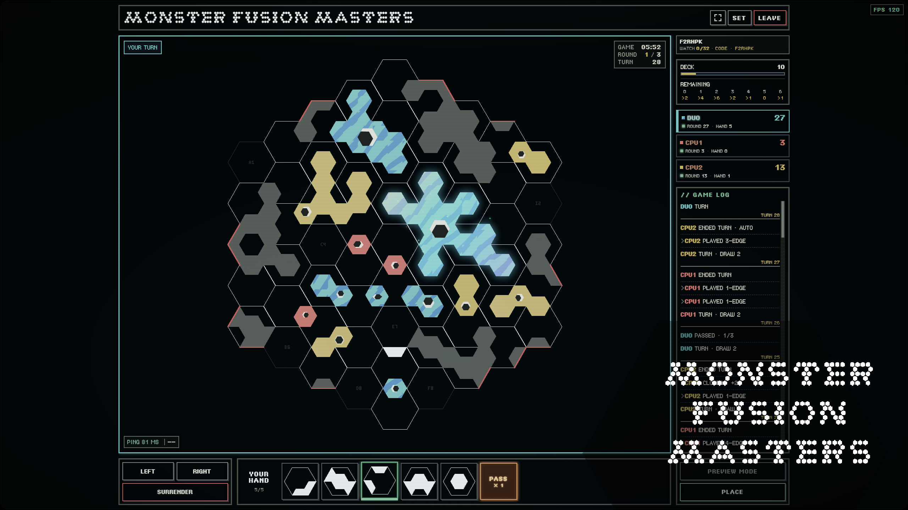

# Monster Fusion Masters

**Showcase 儲存庫名稱：** `monster-fusion-masters-showcase`

**遊玩／線上版本：** [https://mfm.monster-fusion-masters-online.workers.dev/](https://mfm.monster-fusion-masters-online.workers.dev/)

Monster Fusion Masters 是一款原創競技策略棋盤遊戲。最初是我設計的實體桌遊，後來由 Codex 協助把既有設計逐步實作成軟體。

## 遊戲功能

- 免費遊玩，使用瀏覽器即可開始
- 即時多人 PvP 與房間
- AI 對手與積分對戰
- 觀戰模式與新手教學
- 英文及繁體中文介面

## Build process

### 1. 原始實體桌遊 — 2020

Monster Fusion Masters 最初是我設計的原創策略桌遊。核心概念、棋盤與棋子設計、規則、計分方式、平衡設計和實體版本，都早於這次 AI 輔助的開發。2020 年，我公開了可 3D 列印的版本：[Monster Fusion Masters V1 棋盤遊戲](https://www.printables.com/model/35556-monster-fusion-masters-v1board-game)。

### 2. 數位版本的構想

當時我就希望把桌遊做成電子遊戲和線上版本，但缺乏遊戲與程式開發經驗，也不熟悉多人連線和伺服器開發，並且沒有足夠預算完成整個專案。光靠當時的能力，無法把桌遊構想做成可線上遊玩的遊戲。

### 3. 專案暫停

我曾嘗試尋求外部開發協助，但受到開發成本與專案規模影響，始終未能順利推進。數位化的構想因此擱置了多年。

### 4. Codex 協助重啟專案

隨著 AI 輔助軟體開發逐漸成熟，我重新投入這個專案。Codex 協助把已存在的遊戲設計實作成軟體；遊戲本身、規則和平衡設計並不是 Codex 創造的。協助內容包括：

- 將既有規則轉換成程式
- 實作規劃與程式碼分析
- 除錯與重構
- 介面與多人功能實作
- 反覆迭代開發

### 5. 第一個可遊玩的數位版本

原本的桌遊設計逐步轉成可在瀏覽器遊玩的遊戲。這包括以軟體呈現棋盤狀態、棋子放置、回合、計分、遊戲流程和可操作的介面。此處只概述開發工作，不包含 production 實作。

### 6. 線上多人遊戲

要支援線上競技，需要房間、同步的玩家與遊戲狀態、觀戰功能和多人基礎架構。線上服務使用 Cloudflare Workers 與 Durable Objects；伺服器實作不包含在這份 Showcase repository 中。

### 7. AI 對手與積分對戰

數位遊戲後續加入 AI 對手與積分對戰功能。Codex 協助相關實作、除錯與迭代；production AI 和排名系統不包含在這個 repository 中。

### 8. 教學與易用性

新手教學、英文與繁體中文介面，以及持續改進的 UI，讓第一次接觸遊戲的玩家更容易理解規則並開始對戰。

### 9. 持續迭代與平衡調整

遊戲目前仍在開發中。Codex 協助實作、分析程式碼、除錯、修正回歸問題、重構、調整介面與改善系統；原始遊戲設計、規則、平衡決策、玩法方向和功能需求仍由我負責。

### 10. 目前版本

Monster Fusion Masters 已成為免費遊玩的瀏覽器線上競技策略遊戲，包含即時 PvP、AI 對手與積分對戰，目前仍持續開發。

## 本儲存庫內容

本儲存庫僅包含精選 Showcase 素材與非敏感的程式碼範例。

完整 production 原始碼、遊戲 AI、排名邏輯及其他核心系統不會公開發佈。

此資料夾中的範例是通用、精簡的示範，並非 production 實作的副本，也不包含遊戲規則、AI、計分、配對、安全或伺服器系統。

## Showcase 圖片素材

`assets/` 資料夾目前已包含 Showcase 封面；之後可再補上其他遊戲畫面截圖或實體棋盤照片。

